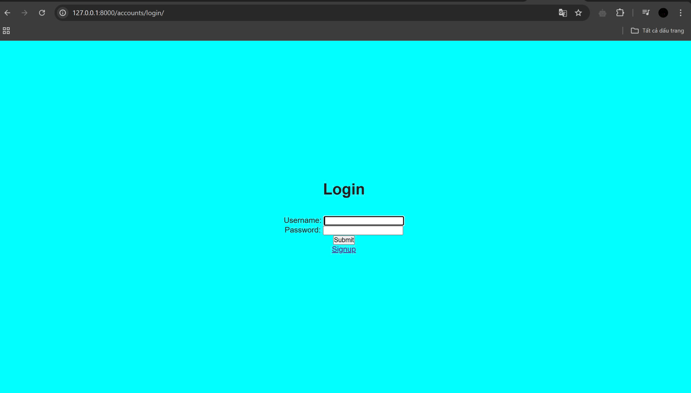

## Release version 2
- Thực hiện tạo ra 1 folder có tên templates/registration, để tạo ra các file html để làm giao diện "đăng nhập" và "đăng ký"
- Để có thể thực thi quyền đăng nhập cũng cần có các mã liên kết với urls.py và views.py để có thể hỗ trợ việc đăng nhập và đăng kí tài khoản người dùng.
- 
