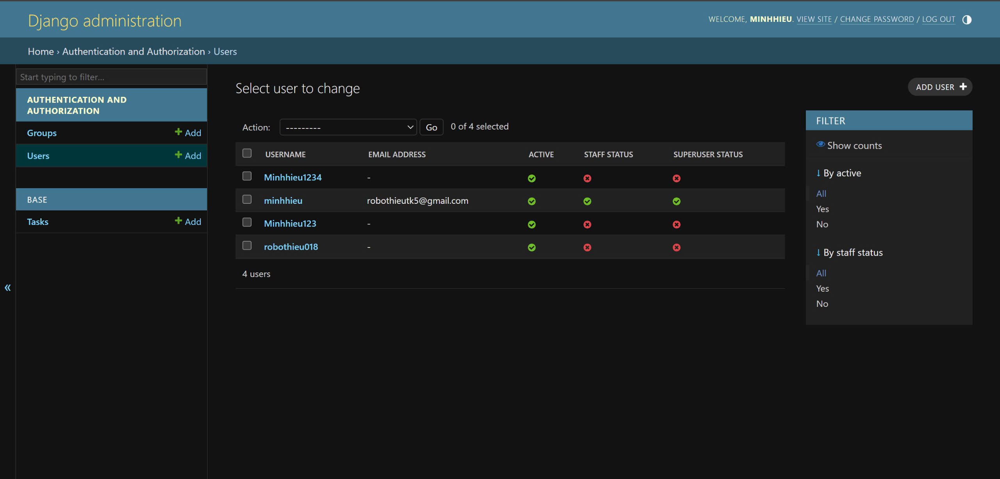
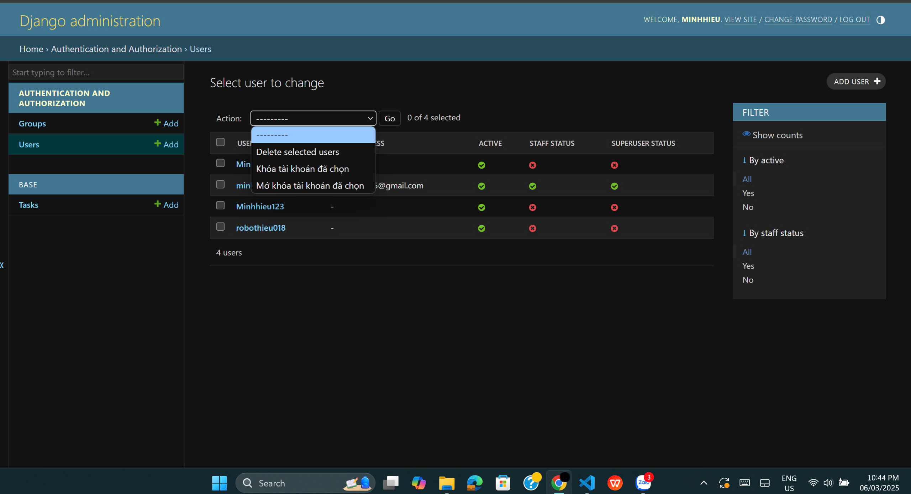
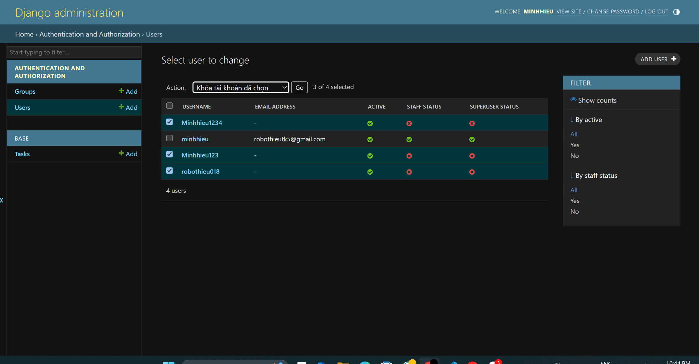

## Release version
- Khi tạo được project bằng lệnh của django khi đó ta đã có được đường dẫn đến trang admin
- Trang quản lí của admin:
- 
- khi đó ta cài đặt thêm các lệnh liên quan để có thể thực hiện việc khóa tài khoản người dùng.
- 
- Trước khi khóa:
- 
- Sau khi khóa:
- 
