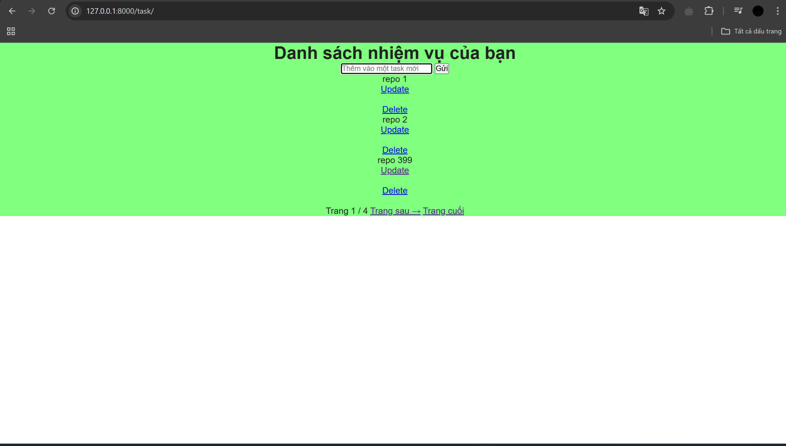
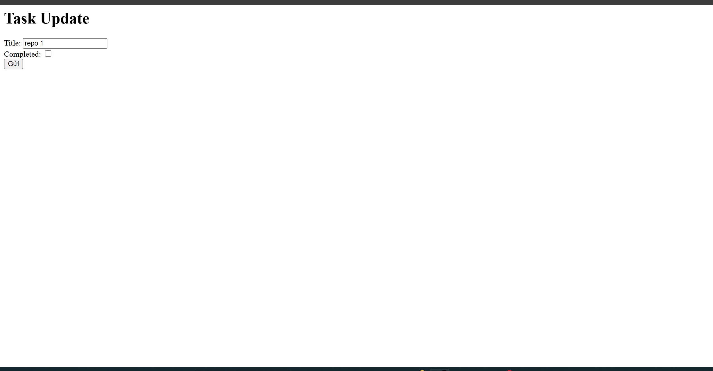

#### relateion 4
- Thực hiện việc tạo trang task.html để làm giao diện chính cho task.
- 
- Trong đó có các update_task.html, dùng để cập nhật lại các task đó.
- Và delete_task.html dùng để xóa task đó.
- - 
